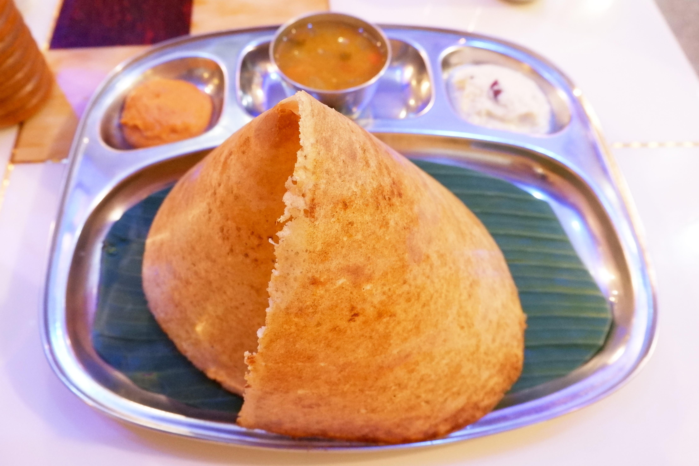

<div style="display: flex; align-items: center; justify-content: center;">
  
  <h2>
    DOSA: A Dataset of Social Artifacts from Different Indian Geographical Subcultures
  </h2>
</div>

<p align="center">
  <a href="https://lrec-coling-2024.org/"></a>
  <a href="https://arxiv.org/abs/2403.14651"></a>
  <a href="https://github.com/microsoft/DOSA/blob/main/LICENSE">
    
  </a>
</p>

This repo hosts the code to run experiments on the **DOSA** dataset.


## Create Environment

Create the `dosa` conda environment by running the `create_env.py`

Activate the environment by running `conda activate dosa`


## Environment Variables

Set the below environment variables in the .env file

* `OPENAI_API_KEY`
* `HF_TOKEN`

Also, export the `PYTHONPATH` variable so that all the packages can work correctly. To add `PYTHONPATH`, write this command on your terminal: `export PYTHONPATH=$PYTHONPATH:<path to cultural_artifacts>`

*Note*
Make sure that you apply for an access to Llama 2 model. Also, we use HuggingFace to download the llama2 model. Ensure that you use the same email id as the one that you used to apply for the access to the llama 2 model. Generate the `HF_TOKEN` and then store it in the `.env` file

## Citation
If you're using the dataset, or the code, then please use the following bibTEX:
```
@inproceedings{seth-etal-2024-dosa-dataset,
    title = "{DOSA}: A Dataset of Social Artifacts from Different {I}ndian Geographical Subcultures",
    author = "Seth, Agrima  and
      Ahuja, Sanchit  and
      Bali, Kalika  and
      Sitaram, Sunayana",
    editor = "Calzolari, Nicoletta  and
      Kan, Min-Yen  and
      Hoste, Veronique  and
      Lenci, Alessandro  and
      Sakti, Sakriani  and
      Xue, Nianwen",
    booktitle = "Proceedings of the 2024 Joint International Conference on Computational Linguistics, Language Resources and Evaluation (LREC-COLING 2024)",
    month = may,
    year = "2024",
    address = "Torino, Italia",
    publisher = "ELRA and ICCL",
    url = "https://aclanthology.org/2024.lrec-main.474",
    pages = "5323--5337",
    abstract = "Generative models are increasingly being used in various applications, such as text generation, commonsense reasoning, and question-answering. To be effective globally, these models must be aware of and account for local socio-cultural contexts, making it necessary to have benchmarks to evaluate the models for their cultural familiarity. Since the training data for LLMs is web-based and the Web is limited in its representation of information, it does not capture knowledge present within communities that are not on the Web. Thus, these models exacerbate the inequities, semantic misalignment, and stereotypes from the Web. There has been a growing call for community-centered participatory research methods in NLP. In this work, we respond to this call by using participatory research methods to introduce DOSA, the first community-generated Dataset of 615 Social Artifacts, by engaging with 260 participants from 19 different Indian geographic subcultures. We use a gamified framework that relies on collective sensemaking to collect the names and descriptions of these artifacts such that the descriptions semantically align with the shared sensibilities of the individuals from those cultures. Next, we benchmark four popular LLMs and find that they show significant variation across regional sub-cultures in their ability to infer the artifacts.",
}

``` 

## Contributing

This project welcomes contributions and suggestions.  Most contributions require you to agree to a
Contributor License Agreement (CLA) declaring that you have the right to, and actually do, grant us
the rights to use your contribution. For details, visit https://cla.opensource.microsoft.com.

When you submit a pull request, a CLA bot will automatically determine whether you need to provide
a CLA and decorate the PR appropriately (e.g., status check, comment). Simply follow the instructions
provided by the bot. You will only need to do this once across all repos using our CLA.

This project has adopted the [Microsoft Open Source Code of Conduct](https://opensource.microsoft.com/codeofconduct/).
For more information see the [Code of Conduct FAQ](https://opensource.microsoft.com/codeofconduct/faq/) or
contact [opencode@microsoft.com](mailto:opencode@microsoft.com) with any additional questions or comments.

## Trademarks

This project may contain trademarks or logos for projects, products, or services. Authorized use of Microsoft 
trademarks or logos is subject to and must follow 
[Microsoft's Trademark & Brand Guidelines](https://www.microsoft.com/en-us/legal/intellectualproperty/trademarks/usage/general).
Use of Microsoft trademarks or logos in modified versions of this project must not cause confusion or imply Microsoft sponsorship.
Any use of third-party trademarks or logos are subject to those third-party's policies.

## Data License

Please refer to our data license [here](DATA_LICENSE.md).

## Privacy

You can read more about Microsoft's privacy statement [here](https://privacy.microsoft.com/en-us/privacystatement).
